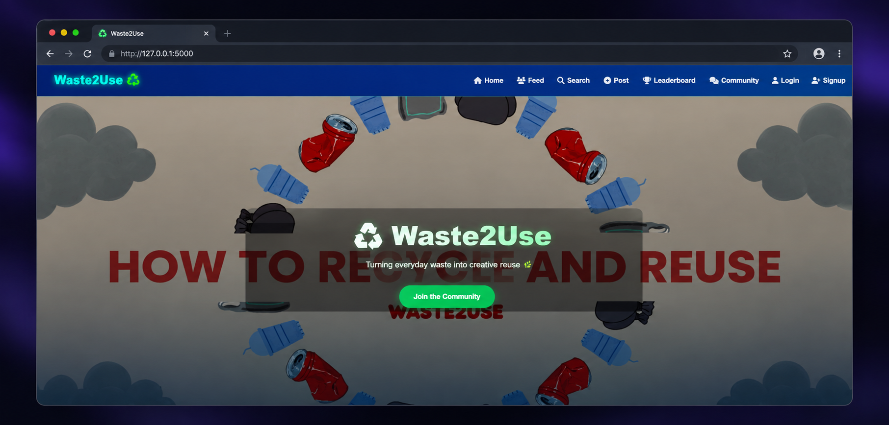

## 🖥️ Project Preview




# 🌱 Waste2Use — Smart Waste Reuse & Sustainability Platform

Waste2Use is a web-based platform designed to encourage sustainability by helping users discover creative ways to reuse waste materials.

## ✨ Features

* 🔐 User authentication
* ♻️ Search for creative waste-reuse ideas
* 📝 Create and share posts
* ❤️ Like and comment on posts
* 🔔 Notifications
* 💬 User interaction and communication
* 🌱 Sustainability-focused reuse suggestions

## 🛠️ Tech Stack

* **Backend:** Python, Flask
* **Frontend:** HTML, CSS, JavaScript
* **Database:** SQLAlchemy-supported database
* **Search:** TF-IDF and cosine similarity for text-based idea matching

## 📁 Project Structure

* `app.py` — Main Flask application
* `templates/` — HTML templates
* `static/` — CSS, JavaScript and static assets
* `data/` — Waste-reuse idea data
* `ml_model.py` — Text-based reuse idea search
* `requirements.txt` — Python dependencies

## 🚀 Getting Started

1. Clone the repository:

   ```bash
   git clone https://github.com/SaloniPatidar77/Waste2Use.git
   ```

2. Open the project folder:

   ```bash
   cd Waste2Use
   ```

3. Create and activate a virtual environment.

4. Install dependencies:

   ```bash
   pip install -r requirements.txt
   ```

5. Run the application using the setup configured in the project.

## 🎯 Purpose

Waste2Use aims to promote creative reuse, reduce waste, and encourage environmentally responsible habits.

## 👩‍💻 Developer

**Saloni Patidar**

* [GitHub](https://github.com/SaloniPatidar77)
* [Portfolio](https://saloni-portfolio-vm0e.onrender.com)
* [LinkedIn](https://www.linkedin.com/in/saloni-patidar-a3a5432ba)
